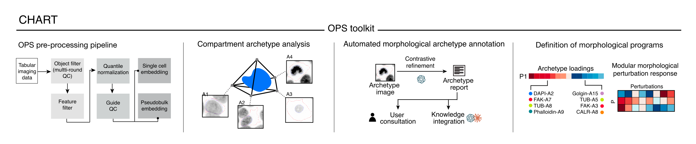

# CHART

**CHART** (**Cellular High-content imaging Archetype Response Toolkit**) translates high-content imaging features into interpretable morphological phenotypes. CHART identifies marker-specific cellular archetypes, annotates representative images using multimodal large language models, and integrates co-regulated archetypes into morphological programs that describe coordinated cellular responses to perturbation.



## Components

- **OPS preprocessing** — quality control, filtering, normalization, outlier detection, guide filtering and single-cell/aggregated embeddings.
- **Compartment archetype analysis** — identification of distinctive reference morphological states for each imaged marker.
- **Automated archetype annotation** — contrastive image analysis and standardized reports generated with multimodal language models and user review.
- **Morphological program definition** — integration of co-regulated archetypes into interpretable programs of coordinated cellular change.

## Configuration

Every step reads one YAML file, given with `--config`:

```
chart --config my_screen.yaml --all-wells
```

Use `example_config.yaml` as a starting point: copy it and edit the paths. Every key in it except the two output directories is optional, and the values shown are the defaults.

The `schema` block maps CHART variables to the input screen, accounting for differences in input column names and feature naming conventions:

```yaml
schema:
  cell_column: object_number
  guide_column: sgrna_id
  gene_column: target_gene
  feature_patterns: ['^Nuclei_', '^Cells_', '^Cytoplasm_']
  control_gene: safe_harbour
  control_prefix: null
  centroid_columns: [Nuclei_Location_Center_Y, Nuclei_Location_Center_X]
```

Every column in `feature_patterns` must be numeric.

Input filenames are configurable in the same file, under
`preprocessing_bywell`. Only `.parquet` input files are accepted.

```yaml
preprocessing_bywell:
  objects_pattern: 'plate1_{well}.objects.parquet'
  features_pattern: 'plate1_{well}.features.parquet'
```

When one file per well holds objects and features together, set  
`premerged: true` and name it with `merged_pattern` instead.